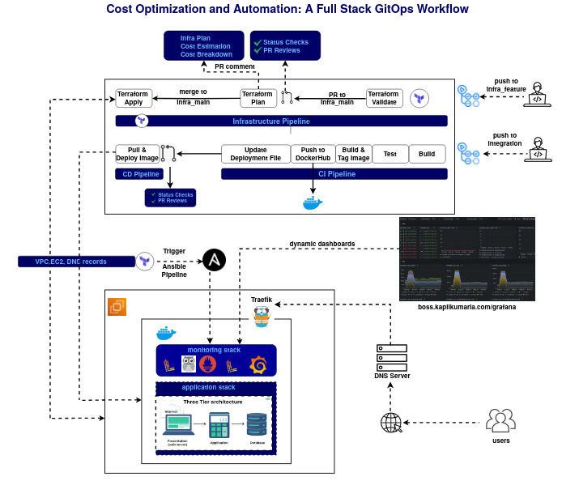
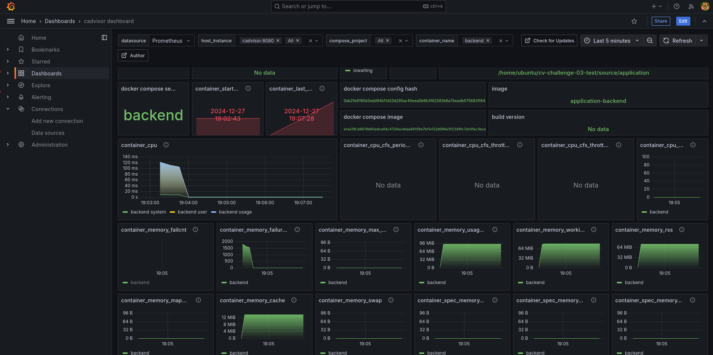
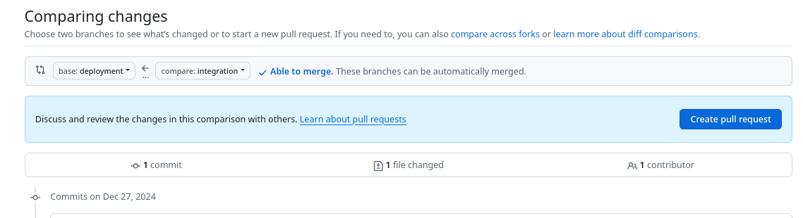

# 💡 Week 3: GitOps Workflow for Automation and Cost Optimization

This project introduces a comprehensive GitOps workflow designed to enhance automation and optimize costs. At its core, it implements GitOps principles by leveraging pull requests to facilitate code reviews, status checks, and discussions before applying any changes to the live infrastructure. The workflow employs fully automated CI/CD pipelines using GitHub Actions and features a robust branching strategy to manage infrastructure and application pipelines independently.

- **Cloud cost optimization** with cost estimation tools like InfraCost.  
- **GitOps workflows** for seamless automation.  
- **Terraform + Ansible integration** for infrastructure management and monitoring stack setup.  
- **Git branching strategies** for streamlined CI/CD pipelines.  

## Infrastructure Pipeline
Provisions and manages infrastructure using Terraform. Provides real-time cost analysis and optimization insights via Infracost. Triggers an Ansible workflow to configure servers and deploy a monitoring stack with dynamic dashboards, instantly accessible via custom domains.

## Application Pipeline
1. **CI pipelines**: Build Docker images for the application and update the deployment file (docker-compose.yml) with the latest image tag. Tags are structured using the workflow run number and short commit SHA for precise traceability (e.g., maestrops/backend:4-0a3087a).
2. **CD pipelines**: Deploy applications only after pull requests are merged, ensuring all changes are reviewed and approved. Post-deployment, applications are accessible through static configurations managed by Traefik.
## Security Enhancements
To maintain robust security: GitHub Actions repository secrets are used for managing sensitive variables. Environment files (.env) for applications are generated dynamically at runtime and securely destroyed after deployment.
## Key Improvements
This iteration emphasizes automation and cost optimization through a GitOps-centric approach. While it continues to utilize the same application source code from Weeks 1 and 2, this setup integrates:

- GitOps principles for streamlined workflows.
- Real-time cost estimation to enhance financial efficiency.
- Dynamic infrastructure and application management pipelines for better scalability and maintainability.
## Objectives
1. **Implement GitOps Principles**: Utilize pull requests to enforce code reviews, discussions, and automated checks, ensuring high-quality changes before deployment.
2. **Enhance Automation Across Pipelines**: Develop fully automated CI/CD pipelines to reduce manual intervention and improve workflow efficiency for infrastructure and applications.
3. **Optimize Infrastructure Costs**: Integrate cost analysis and optimization tools, such as Infracost, to monitor and minimize infrastructure expenses proactively.
4. **Streamline Deployment Processes**: Ensure seamless, traceable deployments by leveraging GitHub Actions, Docker image tagging, and Traefik for static configurations.
5. **Strengthen Security Measures**: Use GitHub Actions repository secrets to protect sensitive data and dynamically generate and securely destroy application environment files.
6. **Improve Monitoring and Observability**: Deploy a monitoring stack with dynamic, custom dashboards for real-time insights into application and infrastructure performance.
7. **Promote Scalability and Maintainability**: Create independent pipelines for infrastructure and application management, enabling easy scalability and future enhancements.
8. **Facilitate Cost-Effective Infrastructure Management**: Leverage Terraform and Ansible to automate provisioning and configuration while maintaining a focus on cost-effectiveness.



### **Components** 
--- 
#### **1. Infrastructure Provisioning (Terraform)**

- **Compute Resources**: AWS EC2 instances for hosting the application and monitoring stacks.
- **Networking Resources**: Configures VPC, subnets, security groups, and internet gateways.
- **DNS Management**: Adds A-record entries in AWS Route53 pointing to EC2 public IPs.
- **Integration with Ansible**:
  1. Dynamically generates inventory.ini files.
  2. Triggers Ansible playbooks post-provisioning.

#### **2. Application Stack**
- **Frontend:** React-based user interface.
- **Backend:** FastAPI for handling API requests.
- **Database:** PostgreSQL for persistent data storage.
- **Reverse Proxy:** Traefik for path-based routing between services and SSL management.

#### **3. Monitoring Stack**
- **Prometheus** Collects and stores application metrics.
- **Grafana** Provides visualizations with preconfigured dashboards for cAdvisor and Loki.
- **cAdvisor** Monitors container-level metrics.
- **Loki** Aggregates logs from the application and system.
- **Promtail** Collects logs from the application and system.

---

### 🌲 **Branch Setup**  

1. **Infrastructure Pipelines:**  
   - `infra_features`: Used for writing and testing Terraform changes.  
   - `infra_main`: Main branch for infrastructure.  

2. **Application Pipelines:**  
   - `integration`: Contains the CI pipeline for building and tagging images.  
   - `deployment`: Contains the CD pipeline for deploying the application stack.  

---

### 📋 **Workflow Details**  

#### **Infrastructure Pipeline**  
**Branches: `infra_features` → `infra_main`**  
- **Push to `infra_features`:**  
  - Run `terraform validate` to check the correctness of configurations.  
- **PR to `infra_main`:**  
  - Trigger `terraform plan`, output the plan as a comment in the PR, including cost estimation (e.g., using InfraCost).  
- **Merge to `infra_main`:**  
  - Run `terraform apply` with auto-approval to provision resources.  
  - Trigger Ansible to deploy the monitoring stack on the provisioned infrastructure.  

#### **Application Pipeline**  
**Branches: `integration` → `deployment`**  
- **Push to `integration`:**  
  - Build and tag Docker images for the application.  
  - Push images to a public Docker Hub repository.  
  - Update `docker-compose.yml` with the new image tags and commit the changes.  

- **Merge from `integration` to `deployment`:**  
  - Deploy the application stack to the provisioned infrastructure.  

##### **Workflow Organization:**  
   - Separate `.yml` files for each pipeline.
        - terraform-validate.yml
        - terraform-plan.yml
        - terraform-apply.yml
        - ansible-monitoring.yml
        - ci-application.yml
        - cd-application.yml





# How to Use This Repository

Follow the steps below to set up and deploy the services defined in this repository:

### Step 1: AWS - EC2 Instance Ubuntu, t2.medium with 50GiB Storage Volume

### Step 2: Install these Packages
- Update System Packages
- Git
- Docker
- Docker Compose
- Terraform
- Ansible
- AWS CLI
- Tree (Optional)

### Step 3: Clone the Repository

Clone this repository to your server to access the application and configuration files.
```
git clone https://github.com/kapilkumaria/cv-challenge-03.git
git branch -a
```

### Step 4: Create an AWS Profile

Set up an AWS CLI profile to manage credentials and region configurations:
```
aws configure --profile=<profile-name>

# Replace <profile-name> with a unique name for your profile (e.g., terraform-profile).

```
Update the provider block in terraform/main.tf to use the newly created AWS profile:

```
provider "aws" {
    profile = "<profile-name>"   # Replace with the profile name you configured
}

```

### Step 5: Switch Branch from `main` to `infra_features`

```
cd cv-challenge-03
git checkout infra_features
ls
```

### Step 6: Navigate to the Terraform Directory

Move into the application folder where the main docker-compose.yml file is located.
```
cd cv-challenge-03/terraform
```

### Step 6: Set Up the Remote Backend

Navigate to the terraform/backend directory.
Run the following commands to create an S3 bucket for storing the Terraform state file remotely and a DynamoDB table for state locking:
```
cd terraform/backend
terraform init      # Initialize the backend configuration
terraform plan      # Preview the changes to be applied
terraform apply     # Apply the changes to create S3 bucket and DynamoDB table

# Note: (Optional) Replace 'S3 bucket name', 'DynamoDB table name' and 'IAM policy for terraform backend access in terraform/backend/main.tf'
```
### Step 7: Configure Terraform Backend to Use Remote S3 for State Management

Navigate to the root terraform/ directory.

Run the following commands to switch Terraform state management from local to remote using the S3 bucket and DynamoDB table created earlier:

```
cd terraform
terraform init       # Reinitialize with the remote backend
terraform plan       # Shows the plan for the resources to be created
terraform apply      # Creates S3 bucket and DynamoDB Table and IAM policy for Terraform to access S3 and DynamoDB backend
```

### Step 8: Copy <aws.pem> File to Your Home Directory

Use the scp command to securely copy your .pem file (AWS key pair) to the home directory of the server where Terraform will be executed:
```
scp -i <aws.pem> <aws.pem> ubuntu@<server_ip>:/home/ubuntu

# Replace <aws.pem> with the name of your key pair file.
# Replace <server_ip> with the public IP address of your server.
```
```
# Ensure that Git does not track this .pem file to avoid security risks:

git update-index --assume-unchanged <path-to-aws.pem>
```
### Step 9: Configure GitHub Action Self-Hosted Runner for Pipeline Execution
- Spin up a new ec2 instance, whcih will act as a GitHub Runner

1. Navigate to Repository/Settings/Code and Automation/Actions/Runners
2. Click - New self-hosted runner
   2.1 Choose Runner image e.g. Linux
   2.2 Run all the given commands on this new ec2 instance
   2.3 We will modify all Pipelines later to be run-on: self-hosted

### Step 10: Update Security Group Rules in variables.tf

Open the file located at terraform/modules/compute/variables.tf.

Update the security group rules as follows:
    Port 22 (SSH): Set the CIDR block to your IP address for secure SSH access.
    Port 22 (Server/Host): Set the GitHub Runner Server IP address of the server (ec2) where GitHub Action Pipeline is running.

  Example configuration:
```
variable "security_group_rules" {
    default = [
        {
            from_port   = 22
            to_port     = 22
            protocol    = "tcp"
            cidr_blocks = ["<your-ip>/32"]   # Replace <your-ip> with your local IP address
        },
        {
            from_port   = 22
            to_port     = 22
            protocol    = "tcp"
            cidr_blocks = ["<server-ip>/32"]  # Replace <server-ip> with the GitHub Runner Server IP
        }
    ]
}

# Save the changes and proceed with your Terraform steps.
```
### Step 11: Navigate to Ansible to Create `inventory` folder and `ansible.ini` Inventory File

```
cd ansible
mkdir inventory
cd inventory
touch ansible.ini
```
```
vi ansible.ini
```
```
[webserver]
`xx.xx.xx.xx` ansible_user=ubuntu ansible_ssh_private_key_file=~/devops1.pem 

Note: `xx.xx.xx.xx` will be updated dynamically by terraform
```

### Step 12: Navigate to `source` folder and Update Domain name from docker-compose.monitoring.yaml
```
cd source/application
```
```
vi docker-compose.monitoring.yaml
```
- Replace all occurances of `boss.kapilkumaria.com` with your Domain `<your-domain>`


### Step 13: Add GitHub Secrets
 
1. Navigate to Repository/Settings/Code and Automation/Secrets and Variables/Actions
2. Create following New repository secrets

    _AWS_ACCESS_KEY_ID_

    This is the public part of an AWS credential pair. It's used to authenticate with AWS services for tasks such as provisioning infrastructure or deploying applications.

    _AWS_SECRET_ACCESS_KEY_

    This is the private part of the AWS credential pair. It is combined with the access key ID to securely authenticate and authorize API requests to AWS.

    _DOCKER_PASSWORD_

    This is the password for your Docker Hub or a private Docker registry account. It's used in CI/CD pipelines to log in to the registry and push or pull Docker images.

    _DOCKER_USERNAME_

    This is the username associated with your Docker Hub or private Docker registry account. It works alongside the Docker password for authentication.

    _INFRACOST_API_KEY_

    This API key is used to authenticate with Infracost, a tool that provides cost estimates and analysis for infrastructure managed by Terraform. It allows the workflow to fetch detailed cost insights.

    _MY_GITHUB_PAT (Personal Access Token)_

    This is a GitHub Personal Access Token (PAT) that can be used for secure interactions with GitHub, such as triggering workflows, cloning private repositories, or updating deployment artifacts.

    _SSH_PRIVATE_KEY_

    This private SSH key is used for secure SSH authentication. It can be utilized to access remote servers for tasks like configuring infrastructure, deploying applications, or fetching sensitive data.


### Step 14: Git Push/Commit to `infra_features` Branch

```
git status
git add .
git commit -m "<message>"
git push origin infra_features
```
Push to infra_features:

  Will trigger `terraform-validate` and Run terraform validate to check the correctness of terraform configurations.

### Step 15: PR to `infra_main` from `infra_features`


- **PR to `infra_main`:**  
  - Trigger `terraform plan`, output the plan as a comment in the PR, including cost estimation (e.g., using InfraCost).  


### Step 16: Merge to `infra_main`  

- **Merge to `infra_main`:**  
  - Run `terraform apply` with auto-approval to provision resources.  
  - Trigger Ansible to deploy the monitoring stack on the provisioned infrastructure.  
Monitoring stack includes grafana, prometheus, promtail, loki, cadvisor services

### Step 17: Switch Branch from `infra_features` to `integration`

```
cd cv-challenge-03
git checkout integration
ls
```

### Step 18: Generate Letsencrypt Certificate for your Domain

- Store the acme.json (Certificate) in letsencrypt folder e.g `cv-challenge-03-test/traefik/letsencrypt/acme.json` 


### Step 19: Update `TARGET_SERVER_HOST` in GitHub Secrets
- Update `TARGET_SERVER_HOST` with the latest Public IP of target server


### Step 20: Git Push/Commit to `integration` Branch
```
git status
git add .
git commit -m "<message>"
git push origin integration
```
**Branches: `integration` → `deployment`**  
- **Push to `integration`:**  
  - Build and tag Docker images for the application.  
  - Push images to a public Docker Hub repository.  
  - Update `docker-compose.yml` with the new image tags and commit the changes.  

### Step 21: PR to `deployment` from `integration`



### Step 22: Merge from `integration` to `deployment`

- **Merge from `integration` to `deployment`:**  
  - Deploy the application stack to the provisioned infrastructure.  

### Step 23: Test Your Application and Verify the Deployment

Verify the following components to ensure the deployment was successful:
1. **Application Accessibility**: 
  
     1.1 Check if the application is accessible through the reverse proxy.
     
     1.2 Monitoring Dashboards: Confirm that the monitoring dashboards in Grafana are displaying metrics, including: 
     
      1.2.1 cAdvisor: Container-level metrics.
     
      1.2.2 Loki: Logs from the application and infrastructure.

## Access the application and services using the following URLs:
   
   **Application Root**: `https://<your-domain>/`
   
   **API Documentation (Swagger)**: `https://<your-domain>/docs`
   
   **API Documentation (ReDoc)**: `https://<your-domain>/redocs`

   **Database Admin Interface (Adminer)**: `https://<your-domain>/adminer`

   **Prometheus Metrics**: `https://<your-domain>/prometheus`

   **Grafana Dashboards**: `https://<your-domain>/grafana`

Examples:

   https://boss.kapilkumaria.com

   https://boss.kapilkumaria.com/docs

   https://boss.kapilkumaria.com/prometheus

## Import Pre-Built Dashboard

  Import the Container Metrics dashboard using ID: 19792 in Grafana Dashboard


## Additional Features:
  1. **Automatic Redirect to HTTPS**:

        This setup ensures that all traffic to `http://www.<your-domain>` is redirected to `https://<your-domain>.com`
        
  2. **SSL Certificate Issuance**:

        Traefik will automatically issue and manage SSL certificates for your domain, ensuring secure communication.

  3. Replace `<your-domain>` with the actual domain name configured in your deployment.

